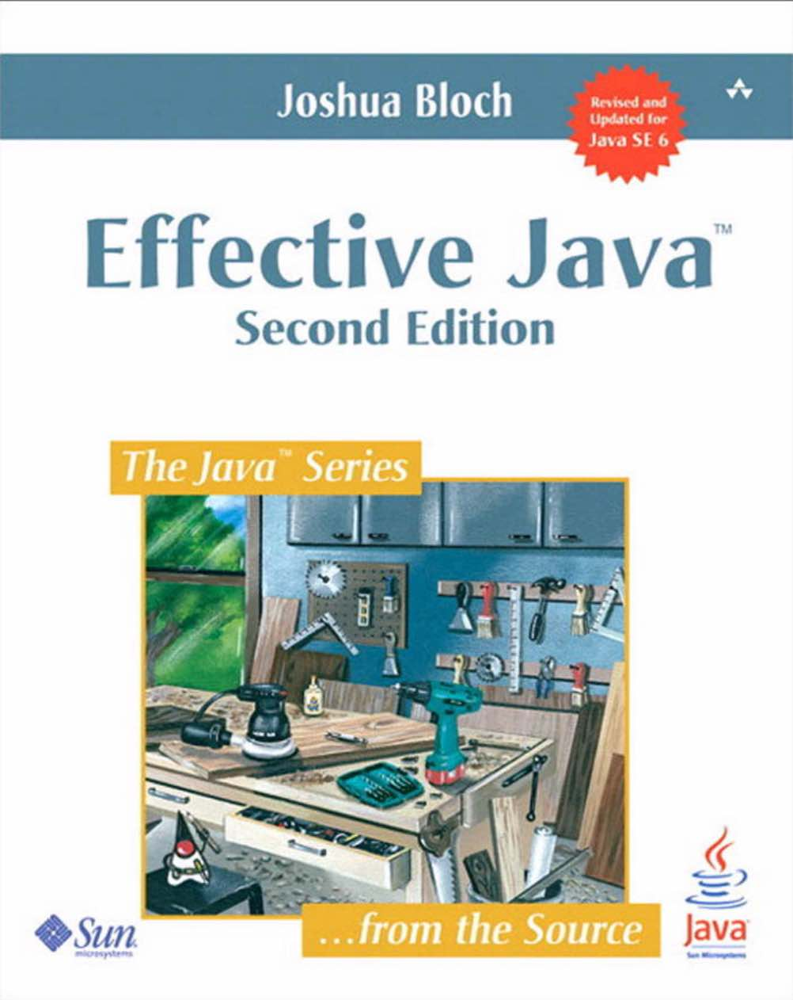

# Introduction to Kotlin
### Andy Bowes
### The JVM Thing
### 20^th^ July 2017
---
## What is ‘Kotlin’?
- ‘New’ programming language |
  - Developed since 2011, v1.0 released Feb 2016
- Developed by JetBrains |
  - Makers of IntelliJ & Android Studio
- Runs on Java Virtual Machine (JVM) |
- Open Source |
---
## What’s wrong with plain old Java ?
- It’s verbose. |
  * Too much ‘boilerplate’ code.
- Slow to Change |
- Multiple overload methods/constructors. |
- Null Pointers |
- Class Cast exceptions |
- Functional paradigm is still a bit of an afterthought. |
---

James Gosling, inventor of Java:
> I sure wish I had this book ten years ago.
> Some might think that I don't need any Java books, but I need this one.
---
## Effective ~~Java~~ Kotlin
- Kotlin is designed as a 'better' Java |
- Directly addresses many issues from Effective Java |
- Many of these will be highlighted during this talk |
---
## Kotlin's Relationship to Java
- All code compiles to pure Java byte-code
- 100% Java Interoperability |
  - Kotlin classes can invoke methods in Java classes
  - Java classes can invoke Kotlin functions
- Kotlin can use standard Java libraries |
- Allows incremental migration to Kotlin from Java |
- Deploy mixed applications as a single artifact |
---
## Simple Data Objects - Java
```Java
import java.util.Date;

public class Person {
   private final String id;
   private final String forename;
   private final String surname;
   private final Date dateOfBirth;

   public Person(String id, String forename, String surname, Date dateOfBirth) {
       this.id = id;
       this.forename = forename;
       this.surname = surname;
       this.dateOfBirth = dateOfBirth;
   }

   public String getId() {
       return id;
   }

   public String getForename() {
       return forename;
   }

   public String getSurname() {
       return surname;
   }
```
---
## Simple Data Objects - Kotlin
```Kotlin
import java.util.Date

data class Person(val id: String,
    val forename: String,
    val surname: String,
    val dateOfBirth: Date)
```
---
## Simple Data Objects - Kotlin (continued)
Implementations of toString(), equals, and hashCode() are automatically created.

A method to clone an object with

```


```
---?include=slides/basicSyntax.md

---?include=slides/dataObjects.md

---?include=slides/nulls.md

---?include=slides/smartCast.md

---?include=slides/classes.md

---?include=slides/functionParameters.md

---?include=slides/functionalProgramming.md

---?include=slides/collections.md

---?include=slides/extensionFunctions.md
